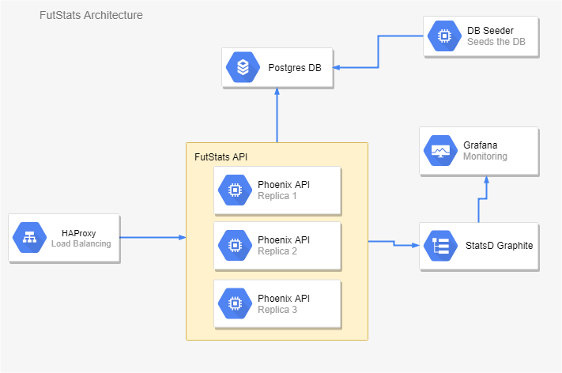

# Derivco - FutStats

## Architecture

A high level view of the solution is given beow.

## Design

The application is based on Phoenix Framework which internally uses Plug and Cowboy. So the app is a set of models, controllers and their respective views.

The API routes have been defined in the `Router.ex` file. Every incoming request to the server goes through a plug pipeline. The response is rendered according to the views associated with each controller. Views are defined in `fut_stats_web/views` while the controllers reside in `fut_stats_web/controllers`. The API is capable of sending `JSON` as well as `protbuf` responses.

The application uses `ecto` to communicate with a Postgres Database. Ecto supports `schemas` which directly map to database tables. The schema for the football data resides in `fut_stats/models`.
Before we can start seeding or querying the database we need to run the migrations. `ecto.migrate` maps a schema to a migration script which is executed to create a database table. The database is seeded using the `seed.exs` script. This process is done inside a separate ephemeral container called a seeder to keep the architecture simple.

Logging and Metrics are done using Elixir's native logger and the `Instruments` package. `StatsD` is used for the collection of the time series metrics data. In `Application.ex`, several important probes have been defined to measure `Beam` performance and resource usage. API response times and request rates are calculated by a custom plug `Plugs.Metrics`. Ecto query performance measured by a custom ecto logger `Repo.Metrics` which writes the query count and response times to the StatsD server.

Swagger has been used as the way to document the HTTP APIs and ex_doc has been used to make the documentation

## Running the Application

The application comes bundled with a `.Dockerfile` and a `docker-compose.yml` file for easier deployments.

Make sure you have `Docker` and `Docker Compose` installed.

Initialize a Docker swarm on your machine if you haven't so already.

`docker swarm init`

(In case if the command prompts you for specifying an IP run `docker-machine ls` and input the default IP)

 Then execute the following command to run a shell script. (Make sure it is executable, if not run `chmod +x run.sh`)

`./run.sh`

This script does the following

- delete any existing host volumes for the docker-compose.yml and create new ones
- delete any existing stack with the name `futstat`
- build the docker-compose.yml
- deploy a stack named `futstat` using the docker-compose.yml

These steps are only required the first time you are deploying the stack, in the subsequent turns you could just do the deploy stack step and it would work fine. And feel free to map the host ports to different one's if any of them are occupied by existing services.

You may have to wait for a few seconds until all the containers have successfully started.(The seeder service seeds the database with the test data)

- The FutStats API would be live at `http://<Host-Address>/api/`
- Graphite console at `http://<Host-Address>:3100`
- Grafana console at `http://<Host-Address>:3000`
- Swagger API console at `http://<Host-Address>/swagger/`

Host-Address could be `localhost` if running locally or an external IP if running in a cloud VM.
